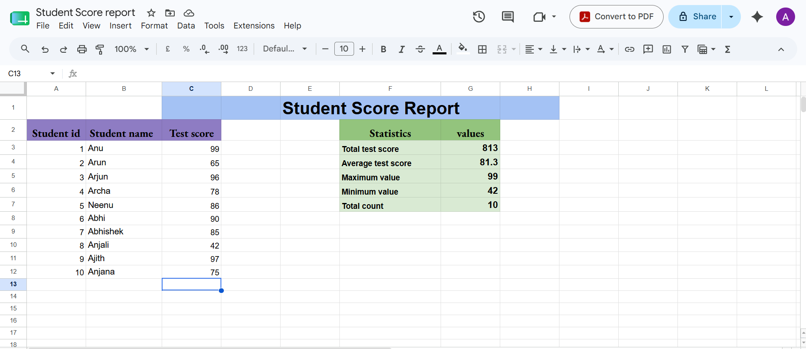

# Google Sheets Basics - Student Score Report

## Objective
This worksheet demonstrates the basic features of Google Sheets, including data entry, formatting, and the use of built-in functions for simple data analysis.

## Worksheet Title
**Student Score Report**

## Data Used

| Student ID | Student Name | Test Score |
|------------|--------------|------------|
| 1 | Anu | 99 |
| 2 | Arun | 65 |
| 3 | Arjun | 96 |
| 4 | Archa | 78 |
| 5 | Neenu | 86 |
| 6 | Abhi | 90 |
| 7 | Abhishek | 85 |
| 8 | Anjali | 42 |
| 9 | Ajith | 97 |
| 10 | Anjana | 75 |

## Functions Used

| Statistic | Formula |
|------------|---------|
| Total Test Score | `=SUM(C3:C12)` |
| Average Test Score | `=AVERAGE(C3:C12)` |
| Maximum Value | `=MAX(C3:C12)` |
| Minimum Value | `=MIN(C3:C12)` |
| Total Count | `=COUNT(C3:C12)` |

## Results

| Statistic | Value |
|------------|-------|
| Total Test Score | 813 |
| Average Test Score | 81.3 |
| Maximum Value | 99 |
| Minimum Value | 42 |
| Total Count | 10 |

## Formatting Applied

- Added a worksheet title: **Student Score Report**
- Used bold headings for table columns
- Applied background colors to title and statistics sections
- Organized data into separate tables
- Adjusted column widths for readability

## Screenshot

Upload your screenshot as `student-score-report.png` and display it below:

```markdown

```

## Conclusion

This Google Sheets worksheet successfully demonstrates basic spreadsheet operations, including data entry, formatting, and statistical calculations using built-in functions such as SUM, AVERAGE, MAX, MIN, and COUNT.# student-report-card
it is a student test score report card analysis in spreadsheet
